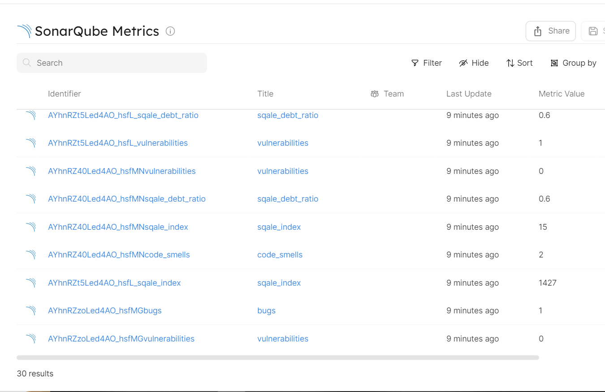

# Ingesting SonarQube Metrics

## Getting started

In this example, you will create a blueprint for `sonarqubeMetric` that ingests all metrics and analysis performed on your SonarQube projects. You will then relate this `sonarqubeMetric` blueprint to a `service` blueprint, allowing you to display all the metrics generated on a service. Also, you will add some script to make API calls to SonarQube Web API and fetch data for your webhook. Finally, you will configure your Gitlab to create/update your entities in Port every time a deployment or commit is made to a specified branch such as main/dev.

## Service Blueprint
Create the service blueprint in Port [using this json file](./resources/service.md)

## SonarQube Metric Blueprint
Create the metric blueprint in Port [using this json file](./resources/sonarqube_metric.md)

## SonarQube Metric Webhook Configuration
Use the [webhook configuration file](./resources/sonarqube_metric_webhook_config.md) to create your Port webhook. 

Follow the example guide on how to [create a Port webhook](https://docs.getport.io/build-your-software-catalog/sync-data-to-catalog/webhook/#configuring-webhook-endpoints). You will then use the webhook URL to ingest data to Port via REST API.

### Gitlab CI yaml
Place this example `.gitlab-ci.yml` file in your project's root folder

### Gitlab CI Variables
To interact with Port using Gitlab CI Pipeline, you will first need to define your Port credentials [as variables for your pipeline](https://docs.gitlab.com/ee/ci/variables/index.html#define-a-cicd-variable-in-the-ui). Then, pass the defined variables to your ci pipeline script. 

The list of the required variables to run this pipeline are:
- `PROJECT_KEY`
- `WEBHOOK_URL`
- `SONARQUBE_URL`
- `SONARQUBE_TOKEN`

Follow the documentation on how to [obatin a SonarQube token](https://docs.sonarqube.org/latest/user-guide/user-account/generating-and-using-tokens/). 

### Package Entity Created

